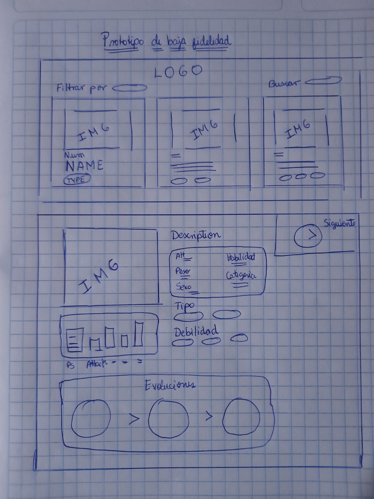

# Data Lovers - Pokédex

Bienvenidos a la Pokédex, una web diseñada para entrenadores Pokémon y fans de todas las edades. Aquí podrás buscar y descubrir información acerca de tus Pokémon favoritos y conocer más sobre los diferentes tipos de Pokémon existentes.

¡Atrapa a todos los Pokémon!

# Instalación

Para utilizar esta aplicación, sigue los siguientes pasos:

**Clona este repositorio.**

En tu terminal, accede al directorio del proyecto y ejecuta el comando __npm install__ para instalar las dependencias necesarias.
Uso
Para utilizar la aplicación, ejecuta el comando npm start en tu terminal y accede a la URL http://localhost:5000/ en tu navegador.

En la página principal, verás una lista de todos los pokemons disponibles. Puedes filtrarlos y ordenarlos según diferentes criterios utilizando las opciones en la barra lateral.

Además, puedes hacer clic en cada pokemon para ver información detallada sobre sus estadísticas y habilidades.

# Contribución
Si deseas contribuir a este proyecto, sigue los siguientes pasos:

*Realiza un fork de este repositorio.
*Clona tu fork en tu computadora local.
*Crea una rama nueva para tus cambios con el comando git checkout -b nombre-de-tu-rama.
*Realiza tus cambios y haz commit con un mensaje descriptivo.
*Ejecuta el comando git push origin nombre-de-tu-rama para subir tus cambios a GitHub.
*Crea un pull request en este repositorio para que podamos revisar tus cambios.

## Índice

* [1. Usuarios](#1-usuarios)
* [2. Prototipo de baja fidelidad](#2-prototipo-de-baja-fidelidad)
* [3. Prototipo de alta calidad](#3-prototipo-de-alta-fidelidad)
* [4. Testeos de usabilidad](#4-Testeos-de-usabilidad)

***

## 1. Usuarios

Para trabajar de manera transparente y enfocarnos en las necesidades de nuestros usuarios, realizamos una investigación que involucró la opinión de **10 fanáticos de Pokémon**, así como la revisión de foros en línea. Gracias a esta recolección de datos, identificamos las necesidades y preferencias de nuestros usuarios.

hacerlo es creando _interfaces_ y _visualizaciones_.

## 2. Prototipo de baja fidelidad

Se desarrollo la idea principal en papel para poder maquetar la base del proyecto

## 3. Prototipo de alta fidelidad

Se recreo la idea principal de papel en Figma

## 4. Testeos de usabilidad

En nuestra primera prueba de testeo el usuario deseaba poder buscar el pokemon y apartir de esa busquedad, cambiar
la seleccion tanto a numero o nombre, pero al realizarlo el filtrado se quedaba en la primera reinjeccion y no retornaban
los 251 pokemons, por lo que añadimos una memory para realizar el filtrado, de esa manera la fuente con los 251 pokemons no era alterada y
los teniamos listos para usarse

En la segunda prueba de testeo, el usuario al buscar solo 1 pokemon, deseaba que la tarjeta mantuviera su tamaño original y no se deformara,
por lo que añadimos un overflow: hidden; a la tarjeta que basicamente establece que el contenido que excede el tamaño del contenedor debe ser ocultado y no visible en el sitio web, mejorando la apariencia de nuestra web.

En la tercera prueba de testeo, el usuario deseaba que los pokemons segun el tipo, cambien el contenedor de sus div, ejemplo en caso que sea
tipo planta = verde, tipo fuego  = anaranjado, etc. Por lo que se establecio un objeto que alberga todas las clases de los tipos, estos se evaluaban y ya en el codigo css, se hacie el cambio de color dependiendo de la condicion.

En la cuarta prueba de testeo, el usuario queria poner buscar un pokemon segun su nombre en tiempo real, al ingresar ch, puedan salir las coincidencias com charizart, charmeleon y charmander, etc. Por lo que se implemento el metodo startWidth para que con cada interaccion pueda ir dando la sugerencia de busqueda de los pokemons.

